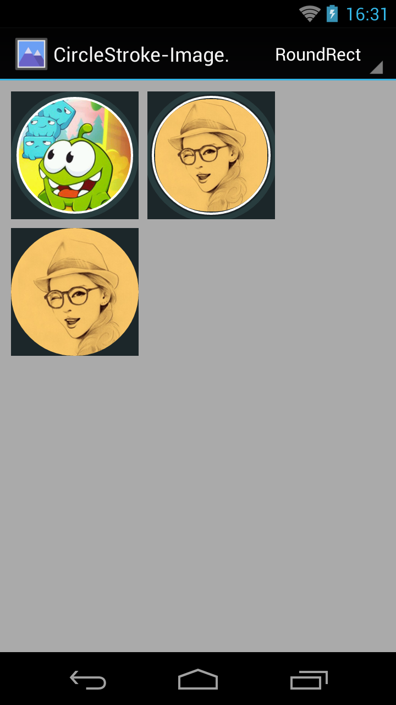

CircleStroke-ImageView-Android
==============================

This widget origin usage is show a member avatar which from network or drawable, and surrounded by two circles(should I call it strokes?).




Diffrence Implementations
=========================

> **1.** Used Canvas.drawRoundRect() & BitmapShader.

This way was popular and accept by [RoundedImageView](https://github.com/vinc3m1/RoundedImageView) which I reference it.
that was most simple, efficient I can find with it, so I'd recommended you to use.

> **2.** Used Picture.beginRecording() a circle path & Xfermode.

I've been lots search to find how could I use **Picture** do something, I found [CustomShapeImageView](https://github.com/MostafaGazar/CustomShapeImageView),
it parsed svg configuration file so we can draw some irregular shapes, actually, the core code only a **Picture**, but parse svg configuration was complex
for me, I can't understand so much. Lucky I extract some code block by Debugger that let me focus on my crop circle intention then I finish that goal.

But use **Picture** was too expensive in this case, performance went down because we creating transient bitmaps which are discarded after they're used,
it might be cause too many unexpected GC pauses, that's reason we used **WeakReference** to cached those final bitmaps in each case.

> **3.** Used Canvas.clipPath() by circle then simply drawBitmap() with it.

Canvas.clipPath() is the other one way to make the goal come ture with several APIs,
but it doesn't support antialiasing & hardware accelerated, we should't use it anymore.

> **4.** Used Canvas.drawCircle() & BitmapShader to draw self scale Bitmap.

That one was my first implementation use pure Canvas to draw everything, I scale target Bitmap used **Matrix**,
But didn't make it look perfect, jaggy problem always follow that I can't solve it.


Sample Application
==================

Of course, people can experience the [sample apk](CircleStroke-ImageView-sample.apk) to enjoy that effort.

Helpful Resource
================

After I study how to make the effect become reality, I got many benefit post from internet :

* [Romain Guy : Android Recipe #1, image with rounded corners](http://www.curious-creature.org/2012/12/11/android-recipe-1-image-with-rounded-corners/)
* [Kirill Grouchnikov : Avatars, avatars everywhere](http://www.pushing-pixels.org/2014/04/10/avatars-avatars-everywhere.html)
* [RoundedImageView](https://github.com/vinc3m1/RoundedImageView)

License
=======

```text
Copyright 2014 Vince Styling

Licensed under the Apache License, Version 2.0 (the "License");
you may not use this file except in compliance with the License.
You may obtain a copy of the License at

http://www.apache.org/licenses/LICENSE-2.0

Unless required by applicable law or agreed to in writing, software
distributed under the License is distributed on an "AS IS" BASIS,
WITHOUT WARRANTIES OR CONDITIONS OF ANY KIND, either express or implied.
See the License for the specific language governing permissions and
limitations under the License.
```
